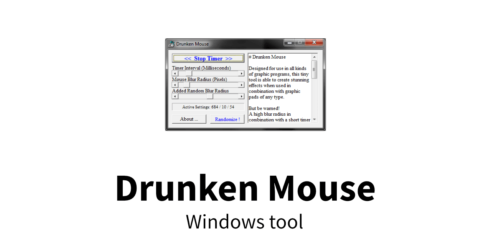
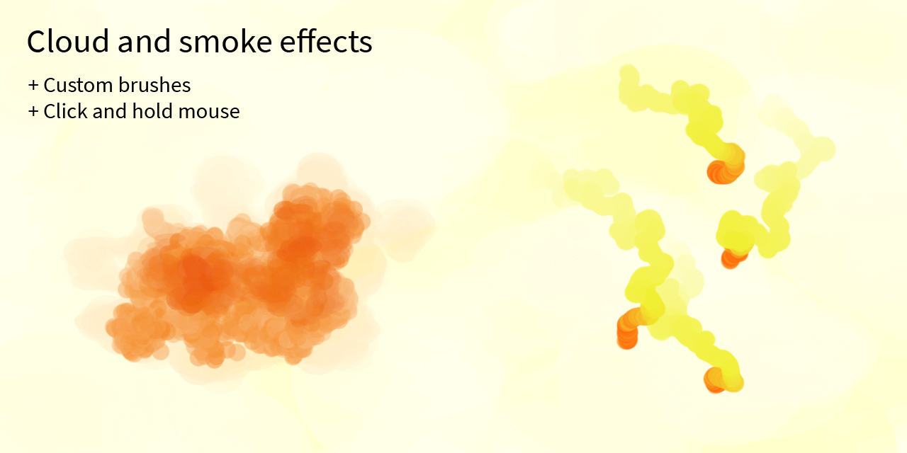
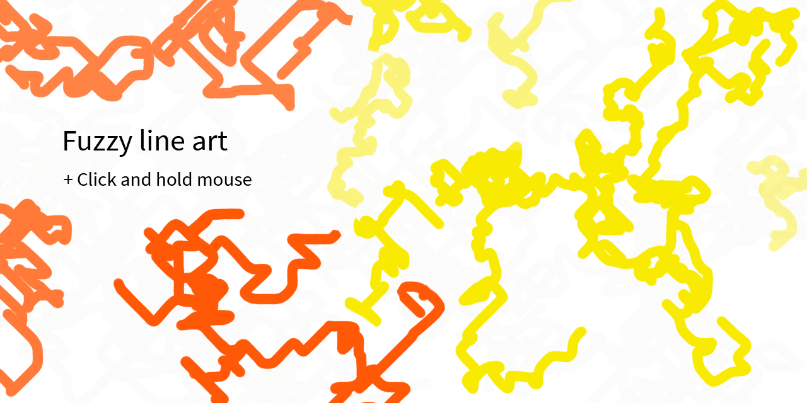
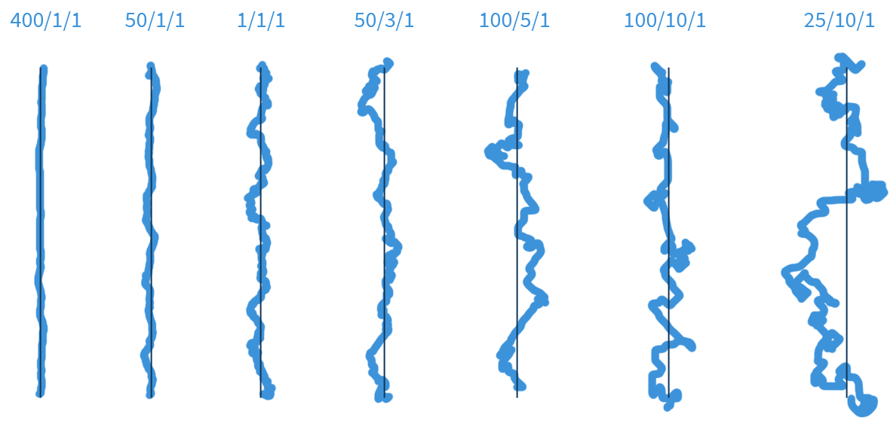

# Creative tool

- [About](#about)
- [Examples](#examples)
- [How to use](#how-to-use)

## About

Randomly shake mouse cursor in different, freely configurable settings. This Windows tool is intended for creative purposes, e.g. drawing software or playing games (with a higher difficulty ;).

  

---

## Examples

Showcase of what you can do with it in graphic software. The shown examples have been done in Photoshop.

### Creative painting

### Settings

  

---

## How to use

Before you download and test this, make sure to get familiar with the notes described below.

**Use at your own risk and responsibility!**

### Important considerations

This software is intended for use on private computers for creative purposes and gaming only.

- **Do not** start when other softwares are still open on your PC (e.g. a browser with open tabs, email tools, any software you might be using that stores and handles important data)
- **Only** use if you know how to switch between Windows and close the app, in case you loose control. Certain settings make it nearly impossible to click accurately and you must use your keyboard instead.
- Make sure to know the keyboard use for this tool and the software you are going to use it with (e.g. your drawing programs or a game). You might need to switch from your current software to the tool and end it.
- It is intended for hardware **Mouses** only. Any other hdardware – like  controllers – might not work properly or lead to unknown, potentially unstable behaviour.

### Preparations

1. Start the desired software to use this tool with
   - If you need, prepare anything beforehand (e.g. setting up custom brushes to draw with)
2. Start this tool (but don't activate it yet)
   - Make sure to know how to close it (e.g. ALT+F4)

**Stay with the default settings for a while.** These are controllable and will only cause minimal distortion for your mouse cursor.

### Run

Just download and run the EXE file.

### Use

Once

#### Compatibility

Tested as working under Windows 7 and Windows 10 with Avast and Windows Defender. Both environments worked fine and allowed the app to run properly.

*Your security tools will probably scan this file and give you a message. If you can't use it, you may decide at your own responsibility to unblock it.*

### Hotkeys

**Make sure that you can navigate with keyboard before starting this tool!**

Navigate between windows and how to stop this tool. Some of them might not work in all applications: You might be asked to confirm. Games might usually not react to this.

| Keys | General use | This tool |
|------|-------------|-----------|
| SPACE | Confirm action on current element (e.g. button) | Toggle buttons on/off |
| TAB | Switch between features within a single application | Switch between app functions (sliders, buttons) |
| SHIFT + TAB | Switch between features within a single application (here: between the app sliders) | |
| Arrow keys | Left/Right to Decrease/Increase values smoothly | Range slider values |
| ALT + TAB | Switch between open Windows | Switch to/from window/here |
| ALT + F4 | Close current window | Close tool |
| WINDOWS | As alternative to using `Alt + TAB`; switch back to Desktop and then proceed to end the tool | Minimize tool |

 

**Commands with 2 keys:** The first key needs to stay pressed, the second will run the desired action.

